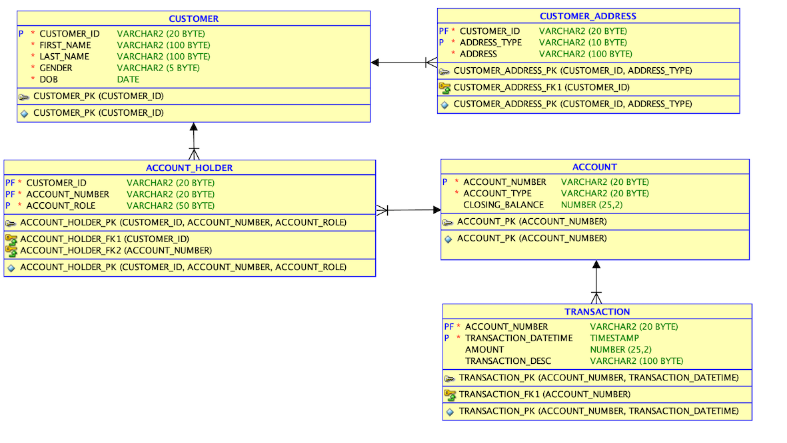
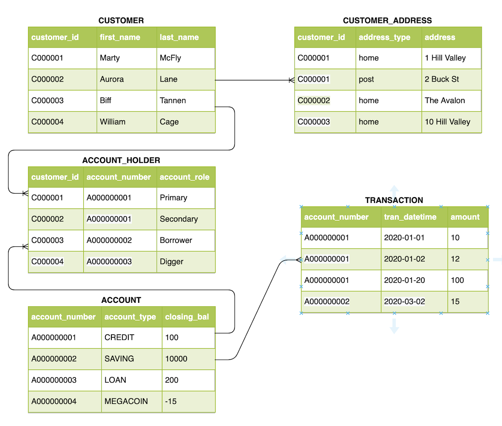

# A POC for loading 3 csv files into MongoDB

## Plan
- design layout
- Read config and parse configure file
- connect to DB
- read file and load into DB with simple json structure
    - load simple file
    - load file with relationship

## Directory layout

```bash
    python_data_load/
    ├── app_config.py       # read and parse app_config.yml
    ├── app_config.yml      # all configuration related to this app, i.e. DB connection
    ├── data_load.py        # read file and load
    ├── database.py         # database related modules
    └── requirements.txt    # python dependency packages.

```

## How to run

To run **data_load**, you need to download the source code. Then open a terminal or command-line window and run the following steps:

1. Create and activate a Python virtual environment

```sh
$ cd python_data_load/
$ python3 -m venv .venv
$ source .venv/bin/activate
(venv) $
```

2. Install the dependencies

```sh
(venv) $ python3 -m pip install -r requirements.txt
```

3. Run the application

```sh
(venv) $ python3 data_load.py
```

## Data model

### ERD


### tabular view



